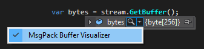
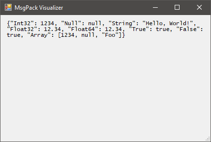

# MsgPack Debugger Visualizer for Visual Studio

Displays a decoded view of MsgPack data from byte arrays when debugging in Visual Studio.

## Usage

When paused in the debugger, select an instance of `byte[]` and launch a visualiser:

Selecting _"MsgPack Visualizer"_ pops up a window showing the decoded MsgPack data.

This window is modal and debugging may only continue once the window is closed.

## Installation

(Notes apply to Visual Studio 2015, but are similar for earlier versions)

1. [Download the latest release](https://github.com/drewnoakes/msgpack-vs-visualizer/releases/latest), or build from source

2. Copy `MsgPackVisualizer.dll` and `Dasher.dll` to either

    > %USERPROFILE%\Documents\Visual Studio 2015\Visualizers
    
    or
    
    > _VisualStudioInstallPath_\Common7\Packages\Debugger\Visualizers

3. Restart the debugging session (you don't have to restart Visual Studio)

## Earlier Visual Studio Versions

You can target earlier versions of Visual Studio by updating the assembly references for
`Microsoft.VisualStudio.DebuggerVisualizers.dll` to the relevant version.

## License

THE CODE IS PROVIDED "AS IS", WITH NO WARRANTIES INTENDED OR IMPLIED. USE AT YOUR OWN RISK!

